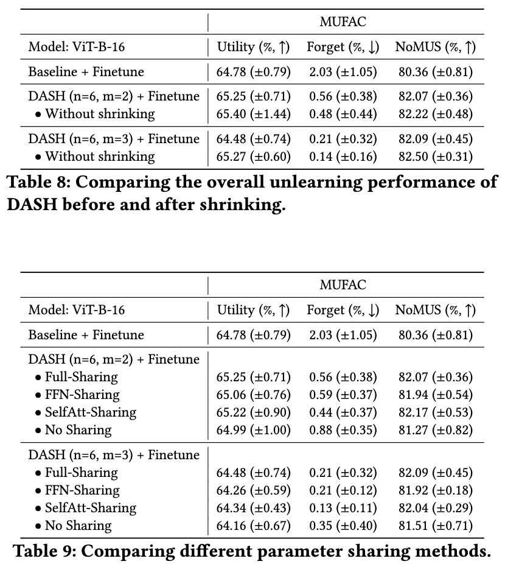

## < Effectiveness of Parameter Sharing >

  

### Basic experiment details:
- We use (ViT-B-16, MUFAC, Finetune) as the representative experiment setting in all ablation studies.
- We run each experiment with 10 random seeds and report the average for all ablation studies.

### Experiment 3.1 Comparison between DASH before and after shrinking
***
We compare the overall performance of DASH before and after shrinking, and the results are summarized in Table 8 above. We notice that the model before shrinking exhibits slightly better overall NoMUS scores across both hyperparameter settings. However, considering the small difference, we advocate for shrinking the model back to the original architecture to maintain equal computational cost with the baseline.

### Experiment 3.2 Partial parameter sharing
***
In this experiment, we explore different parameter sharing mechanisms to gain further insights into how DASH functions. Specifically, we examine (1) FFN-sharing, which shares only the FFN layers, and (2) SelfAtt-sharing, which shares only the self-attention parameters, with the rest of the parameters being newly introduced.

We observe the followings:
- [1] Partial sharing is nearly as effective as full sharing in both cases.
- [2] Self-attention sharing is slightly more effective than FFN-sharing, implying that more data-specific knowledge is stored in the self-attention parameters compared to the FFN parameters.
- [3] Self-attention sharing, which exclusively shares the self-attention parameters, outperforms full sharing in the (n,m) = (6,2) setting. This indicates that delving deeper into the parameter sharing mechanism could hold promise for enhancing performance. We leave this as an avenue for future exploration.

### Summmary
***
* The DASH model before shrinking exhibits slightly better performance compared to after shrinking. However, we believe it is good practice to revert to the original model since the difference is not significant, and the increased runtime might become burdensome.
* Self-attention parameters are likely to store more data-specific knowledge compared to FFN parameters. Exploring efficient unlearning algorithms based on this finding could be an interesting future work.
* Full parameter sharing, the current baseline mechanism used in DASH, may not be the optimal sharing mechanism. Further investigation into identifying a more effective parameter sharing mechanism could be an intriguing avenue for future research.
